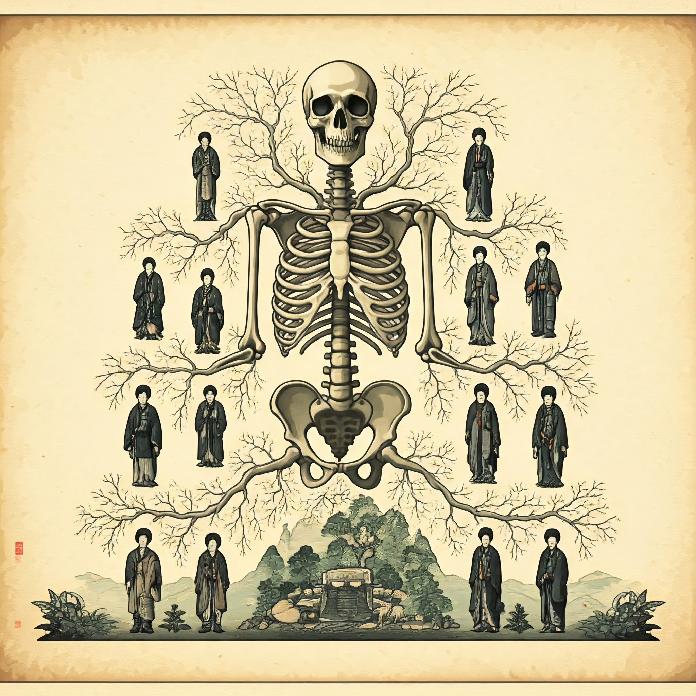

# descendents 

- this is one of the stoic challenge decks
- memento mori
- prepare for your funeral
- this is a page for my descendents
- anymore people die and their stories sometimes last one generation 
- now there's digital information no reason to lose it
- but you have to create it... 
- this site has a bunch of crap but I've updated things for myself
- need to find what might be interesting that has not been posted

## highlights

- get the family photos digitized
- stuff i did

## art class

- art class: won some awared in kindergarten that was displayed in some exp
- it was a simple water color of the tree & i just copied what the teacher did
- it just happened naturally intricate branches & leaves a fence w/ a bird on it and a squirrel or something
- someone might have it
- later in art class the assignment was clay sculptures
- made a double humped camel? russ has it pretty cool
- later in art class i found out i could draw people
- some faces were easy some difficult with practice i could do any face I'm sure
- years ago i bought a lead drawing kit pencil holders stencil erasers and some sketch instruction books at a store in edmonds should come back to it

## music

- these videos are on this site
- many stories i can add later that are amusing

## glass art

- i have some photos & an old website for this
- for a few years i did "lampwork" which is smaller torch work
- small marbles beads pendents sculptures

## athletics in school

- didn't lift weights till i was like 40 something but i highly recommend strength training build a power rack in your garage or home for sure
- max started in high school he transformed
- in jr high sometimes at practice we'd measure my throws
- some were further than the class record but it never happened in a meet so no trophy
- jr high got a bunch of ribbons me and scott kind of split them all it was awkward we each had a fistfull of ribbons after a very long ceremony scott and i kept walking back and forth to the podeum for like an hour it was a strange comedy

## books

- have a bunch of unfinished book ideas i need to compile
