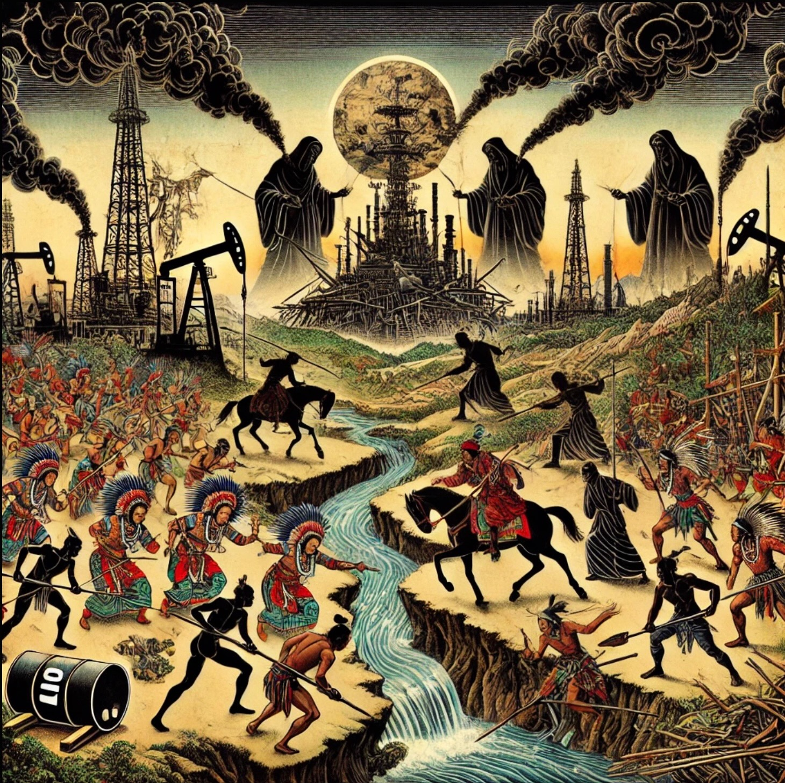

---
tags:
  - entropy 
  - fear
  - amor fati 
---
# fuel

> What is the minimum size of a biosphere? this is one of my favorite questions

- long term - our wants might destroy our needs energy is one of many wants that we don't need
- short term - there is no energy transition we have not found a sustainable energy source
- suppose we terraformed a different sized planet would we or our plants survive long term with lower or higher gravity?
- our desire for energy and money and war and power is causing extinction
- preservation of the ecosystem is synonymous with sustainability
- ecological overshoot is one of my favorite topics
- it started when I was a child living closer to nature
- my instinct toward sustainability would overwhelm me
- I would get quite frustrated
- but could not put it into action or even words and carried on with life
- later it started to make sense: see my mentors page for more details how
- preserving the human species is not a priority for governments they are stuck being mundane tribal warriors fighting over scarce & imagined scarcity
- the majority of human behavior is spent on trivial activity not essential
- that is our biggest obstacle
- reminds me of this buddhist quote

> For innumerable kalpas, I have pursued the trivial instead of the essential, drifted through all spheres of existence, created much animosity and hatred, maligned and harmed others endlessly. Even though now I have done no wrong, I am reaping the karmic consequences of past transgressions. It is something that neither the heavens nor other people can impose upon me. Therefore I should accept it willingly, without any resentment or objection.

- this problem is not new its just a modern form of greed
- how long have humans been behaving this greedy?
- there is a lot of irony embedded in this image chatgpt generated
- I did not mention natives in my prompt to generate an image for this page
- if I had a magic wand I'd go create a sustainable city
- what I think sustainable is more aligned with what william rees advises
- draft horse & ox
- if it doesn't have a butthole its probably not sustainable
- sustainable includes the circle of life
- if you disagree you are likely struggling with "human exceptionalism"
- we do not know the requirements of a human body we have yet to built a biosphere

## oil computation

- oil is low entropy it is a result solar energy gravity and heat

To express the formation of oil as a low-entropy hydrocarbon, we need to look at the overall process through thermodynamic concepts.

The formation of oil involves several stages:

1. **Biological origin**: The process starts with the absorption of solar energy by plants and microorganisms (such as plankton), which perform photosynthesis. In this process, the energy from sunlight is captured and stored in the form of chemical bonds in organic molecules.

2. **Decomposition and burial**: When these organisms die, they accumulate in sedimentary layers. Over time, these layers are buried by additional sediments, and the organic material is compressed and subjected to increasing pressure and heat.

3. **Thermal maturation**: The increasing heat and pressure over millions of years cause chemical reactions that break down the complex organic molecules into simpler hydrocarbons, such as kerogen, which eventually form liquid oil.

Now, from a thermodynamic point of view, **oil** is considered a **low-entropy** substance because it represents a high degree of order in terms of energy storage (in the form of chemical bonds) relative to its environment. Entropy, in this context, is a measure of disorder or the number of possible microstates (ways in which energy can be distributed).

### Thermodynamic Expression for the Low Entropy Hydrocarbon

A computation for the **entropy change** in the formation of oil can be roughly framed using the **Gibbs Free Energy** (\( \Delta G \)) for the reactions involved. The formation of oil from its precursor organic material involves complex biochemical and thermodynamic processes that can be described as:

$$
\[
\Delta G = \Delta H - T \Delta S
\]
$$

Where:

- \( Delta  \) is the change in Gibbs Free Energy, representing the "drive" for the reaction to occur spontaneously.
- \( \Delta H \) is the change in enthalpy (heat content), which is typically exothermic as energy is released during the process.
- \( T \) is the absolute temperature at which the reaction occurs.
- \( \Delta S \) is the change in entropy.

In the case of oil formation, the entropy change (\( \Delta S \)) is typically negative, indicating a decrease in disorder as the complex organic molecules (with high entropy) break down into simpler hydrocarbons (which have lower entropy).

### Chemical Representation of the Process

The overall chemical reaction for the formation of oil can be simplified to:

$$
\[
\text{Complex Organic Material} \xrightarrow{\text{heat and pressure}} \text{Hydrocarbons (Oil)}
\]
$$

This involves the breakdown of long-chain organic molecules into smaller hydrocarbons, releasing energy in the form of heat, and reducing entropy in the process, as simpler molecules with lower entropy are formed.

### Conclusion

In thermodynamic terms, the formation of oil from organic material can be understood as a **process that decreases entropy** relative to the environment because it leads to the creation of a relatively stable and low-entropy product (the hydrocarbon oil), even though the initial energy input (sunlight and photosynthesis) was high.

To express this mathematically:

- **Low-entropy hydrocarbon** = **oil** is a result of an entropy decrease during the transformation of biologically stored energy (via photosynthesis) into a more ordered state (chemical bonds in hydrocarbons) under the influence of heat and pressure.

## chat bot

- the corporate robots responded with most of this text
- therefore corporate censorship & misinformation is likely embedded in this text

## finite fuel exhaustion

- humanities solutions just create more problems and deplete resources faster and faster
- regardless the resource they are all finite
- if it poops its renewable
- wood
- coal
- oil
- atomic
- solar
- wind
- geothermal
- fusion
- hydrogen

## oil

- oil takes millions or billions of years to replenish?
- it is compress corpses fossils with gravity solar energy and  
- in a couple generations it will be depleted
  - low entropy
  - viscous
  - flammable liquid
  - hydrocarbon

## fake war

- the instinct to fight over finite resources gets exploited
- tribes are blinded by greed
- the ecosystem is a renewable food and shelter supply
- for control it is destroyed in our war for power
- ultimately self defeating suicide for our species
- blind spot: ecosystem destruction is erroneously considered an insubstantial collateral death all that matters is controlling the fuel
- War, their barbaric tool, determines who wields control
- A cabal of warmongers, pulling strings from the shadows, orchestrates these conflicts,
- both international and corporate.
- They weave oil into the fabric of resource control, suffocating life's essence.
- By dismantling nature's intricate tapestry, they seek to replace it with their own, a synthetic prison for humanity.
- In this reckless pursuit of domination, they risk the annihilation of Earth and all its inhabitants.
