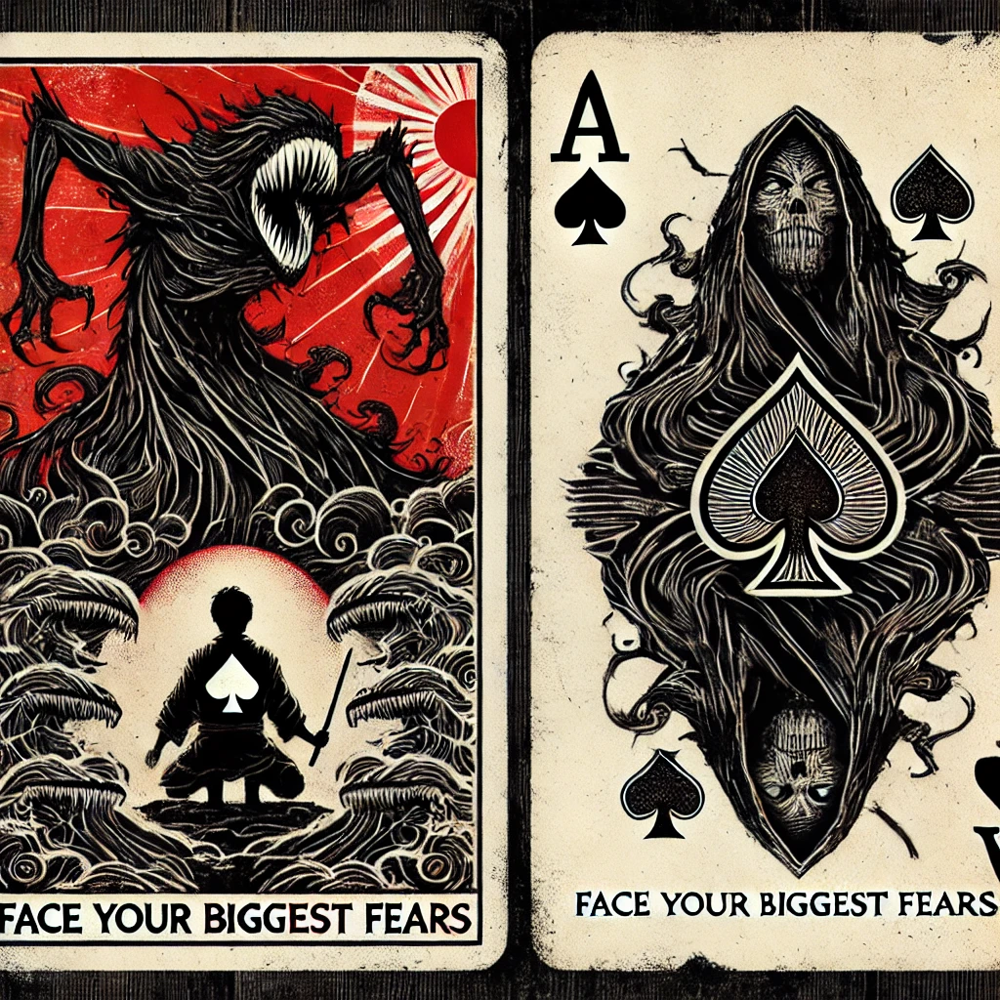

# build the discipline to think well live well be well

- these are my research notes on stoicism
- in 2024 my son and I got some [stoic challenge card decks](challenge.md){ .md-button }
- these pages either are about a challenge card or a topic that emerges from a card
- some of those cards are about facing your deepest fears therefore this site can get very dark
- warning this is sort of hard mode some of these topics are extremely dark and challenging
- I think much of stoicism was derived from [buddhism](https://shanenull.com/buddhism/) they overlap
- these topics overlap so much it can get confusing
- lately the stoicism facing your fears led me down a rabbit hold into thermmodynamics
- so I may end up making a site just for that topic

## face your fears to light up your blind spots

[TAGS]
