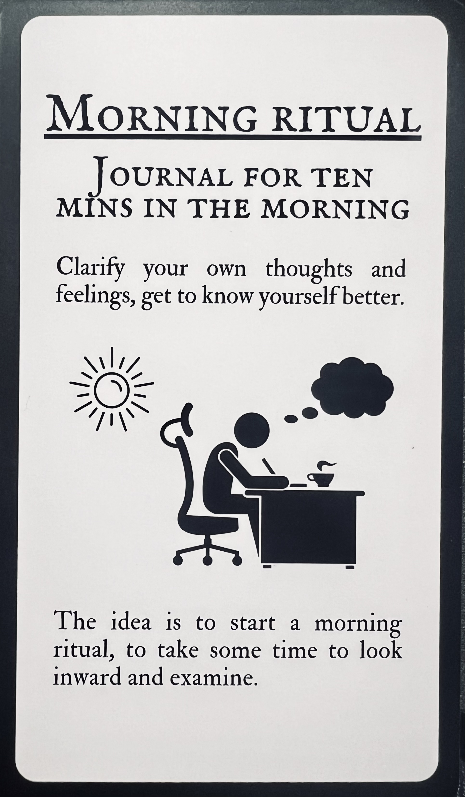

---
tags:
  - stoic challenge 
---
# morning ritual

- know thyself

## tasks

- [ ] find the wardrobe challenge it applies to morning ritual

## gratitude

- gratitude: be happy you & your family are still breathing

## yoga

- nerves

<iframe width="374" height="665" src="https://www.youtube.com/embed/-xHoBlIHhgQ" title="How To Activate Your Entire Body In The Morning - Start Your Day Right - Part 2" frameborder="0" allow="accelerometer; autoplay; clipboard-write; encrypted-media; gyroscope; picture-in-picture; web-share" allowfullscreen></iframe>

- squat

<iframe width="966" height="543" src="https://www.youtube.com/embed/HLha33SzaaU" title="PHENOMENAL RESULTS ! This One Exercise Will Change Your Life | Every Morning 21 Times | Sadhguru" frameborder="0" allow="accelerometer; autoplay; clipboard-write; encrypted-media; gyroscope; picture-in-picture; web-share" allowfullscreen></iframe>

- upa

<iframe width="966" height="543" src="https://www.youtube.com/embed/QjGF2MLdIz8" title="Isha Upa Yoga - 30 mins" frameborder="0" allow="accelerometer; autoplay; clipboard-write; encrypted-media; gyroscope; picture-in-picture; web-share" allowfullscreen></iframe>

## 2023-12-24 checklist & timebox

- appreciating vacation using the time for stoicism, buddhism, journaling
- this is a lot of stuff for the morning if I simplify it I can be more consistent
- yoga & meditation to do in the morning lol
- as taught in level 1 class <https://shanenull.com/buddhism/2023/level_1/>
- use their format in daily life when time allows
- chant, silent meditation, walk, train & dedication of merits
- today I'm practicing the [heart sutra](https://shanenull.com/buddhism/2023/heart_sutra_details/)
- updating sites

<iframe width="1126" height="633" src="https://www.youtube.com/embed/iqs5RUa0B7c" title="7 THINGS YOU SHOULD DO EVERY MORNING (Stoic Routine)" frameborder="0" allow="accelerometer; autoplay; clipboard-write; encrypted-media; gyroscope; picture-in-picture; web-share" allowfullscreen></iframe>

## 2023-11-20 impermanence

- practice one minute left
- [maranasati](https://shanenull.com/buddhism/2023/maranasati/)

<iframe width="560" height="315" src="https://www.youtube.com/embed/5SBrCdRTX8o?si=Jzo2BhX1CVvw5Lqd&amp;clip=UgkxPDMd9M_qYSZ6Cjm36BSw39xEoHZF0qpR&amp;clipt=EIaLPxjA9UA" title="YouTube video player" frameborder="0" allow="accelerometer; autoplay; clipboard-write; encrypted-media; gyroscope; picture-in-picture; web-share" allowfullscreen></iframe>

- one thing I reflect on is that I living in the cascadia subduction zone, this is a stupid place to be

<iframe width="1126" height="697" src="https://www.youtube.com/embed/Ibxaw4FimBI" title="The Next Cascadia Earthquake: Worst Case Scenario" frameborder="0" allow="accelerometer; autoplay; clipboard-write; encrypted-media; gyroscope; picture-in-picture; web-share" allowfullscreen></iframe>
