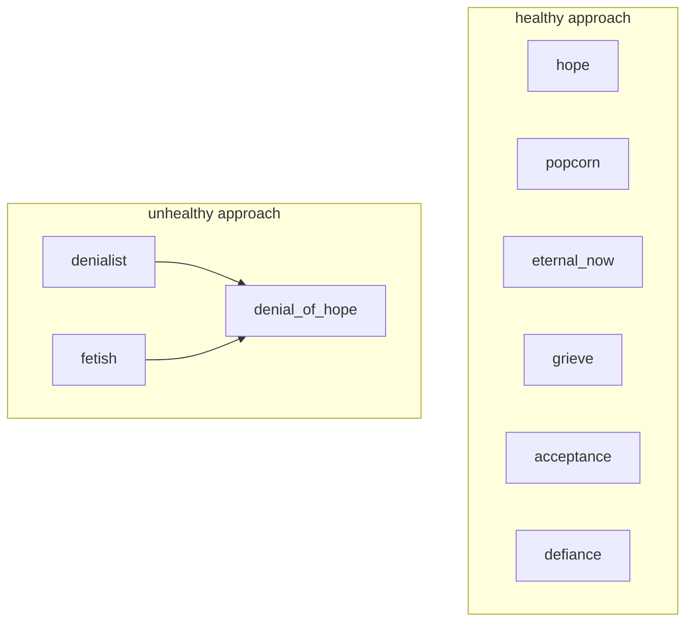
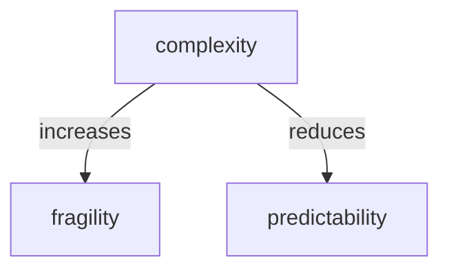
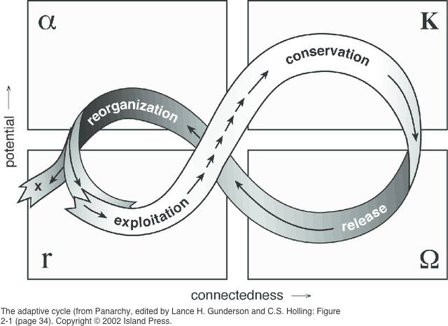

---
tags:
  - mentors 
  - influence 
---
# sid smith

- <https://bsidneysmith.com/>

<iframe width="1557" height="605" src="https://www.youtube.com/embed/CtfpVcbmrTU" title="Sid Smith: Post-doom with Michael Dowd (Dec 2019)" frameborder="0" allow="accelerometer; autoplay; clipboard-write; encrypted-media; gyroscope; picture-in-picture; web-share" referrerpolicy="strict-origin-when-cross-origin" allowfullscreen></iframe>

## notes on his collapse videos

- this playlist is brilliant & makes me curious how he came to these conclusions

<iframe width="560" height="315" src="https://www.youtube.com/embed/videoseries?si=JAV6BKjtleY4p2tV&amp;list=PLNcGo6a-yKuIubvDb6mIyd0KHQ-7UasJH" title="YouTube video player" frameborder="0" allow="accelerometer; autoplay; clipboard-write; encrypted-media; gyroscope; picture-in-picture; web-share" referrerpolicy="strict-origin-when-cross-origin" allowfullscreen></iframe>

## prologue

### 1 civilization is collapsing not you

- there is some buddhism quote this reminds me of
- the world is suffering therefore I am suffering
- my concern is selfish partially for things happening now in my lifetime
- mainly fires on the pacific crest trail where I spend my summer vacations
- but mainly for my children + future generations

### 2 collapse not an event

- its a process[^1]
- weeks or months for people
- years or generations for civilization

### 3 collapse is not a tragedy

- nothing is permanent even civilization
- civilizations follow an adaptive cycle
- species follow an adaptive cycle
- no species are permanent including ours
- reminds me of dukkha in buddhism or the heart sutra
- pain is inevitable suffering is optional
- natural suffering is aging illness death separation
- unnatural is what our minds create

### 4 the collapse started long ago

- many people I hear say industrialization is when it started
- or industrialized agriculture is when it started
- i think it is much earlier
- we got on the wrong path living unsustainable probably started when we discovered fire

#### sustainability

- what we want is destroying what we need
- this is where humans are acting like maladapted creatures with behavioral lag
- nature deletes those
- cormac quote: the only need is fire in winter water in summer
- but that only applies if you live far from the equator
- it might not even be sustainable to live where you require fire
- how did people keep warm before we discovered fire? huddled used fur shelters
- also to stay warm without fire people sleep on their shins because you lose less heat
- below at 2:47 you can see the sleeping position
- I figure sustainable energy has a butthole to give back to earth
- very small populations with very small local farming using draft horses & ox might be sustainable

<iframe width="1221" height="687" src="https://www.youtube.com/embed/lZCtV4NAu30" title="What is the Optimal Sleeping Posture?" frameborder="0" allow="accelerometer; autoplay; clipboard-write; encrypted-media; gyroscope; picture-in-picture; web-share" referrerpolicy="strict-origin-when-cross-origin" allowfullscreen></iframe>

### 5 don't let collapse get you down

- its not about you
- life has always been filled with tragedies

### hopium

- hope is not hopium
- unrealistic optimism
- false optimism
- belief someone else should or would solve the problem

## collapse charts

### complex dynamic systems

## 1 energy

## 2 complexity

## 3 energy complexity civilization

## 4 why civilizations die

## 5 ecological overshoot

- <https://soundcloud.com/michael-dowd-grace-limits>

## adaptive cycle

a model used to describe the dynamic patterns of change in ecosystems and social-ecological systems. it consists of four distinct phases:

1. **exploitation (r):** this phase is characterized by rapid growth and resource acquisition. new ideas, technologies, or practices are introduced and rapidly adopted. this phase is often associated with innovation and creativity.
2. **conservation (k):** in this phase, the system stabilizes and resources are conserved. established patterns and structures become more rigid, and the system becomes less adaptable.
3. **release (ω):** this phase is characterized by a sudden collapse or breakdown of the system. the rigid structures and patterns that were once beneficial become a liability, leading to a period of chaos and uncertainty.
4. **reorganization (α):** in this phase, the system begins to rebuild and reorganize itself. new ideas and innovations emerge, and the system enters a period of rapid change and transformation.

this cycle is cyclical, meaning that after reorganization, the system will eventually move back into the exploitation phase, and the cycle continues.

it's important to note that the adaptive cycle is not a linear process. it can be interrupted by external factors, and the duration of each phase can vary. additionally, the cycle can occur at different scales, from individual organisms to entire ecosystems.

understanding the adaptive cycle can help us to better understand the dynamics of complex systems and to anticipate and respond to change. by recognizing the patterns of growth, stability, collapse, and renewal, we can make more informed decisions about how to manage and sustain our social and ecological systems.

[^1]: <https://www.resalliance.org/adaptive-cycle>
