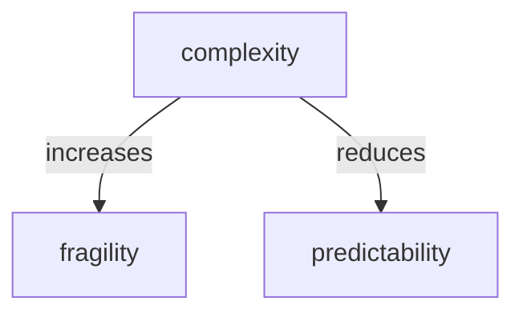

# sid smith

- this playlist is brillian

<iframe width="560" height="315" src="https://www.youtube.com/embed/videoseries?si=JAV6BKjtleY4p2tV&amp;list=PLNcGo6a-yKuIubvDb6mIyd0KHQ-7UasJH" title="YouTube video player" frameborder="0" allow="accelerometer; autoplay; clipboard-write; encrypted-media; gyroscope; picture-in-picture; web-share" referrerpolicy="strict-origin-when-cross-origin" allowfullscreen></iframe>

## complex dynamic systems

