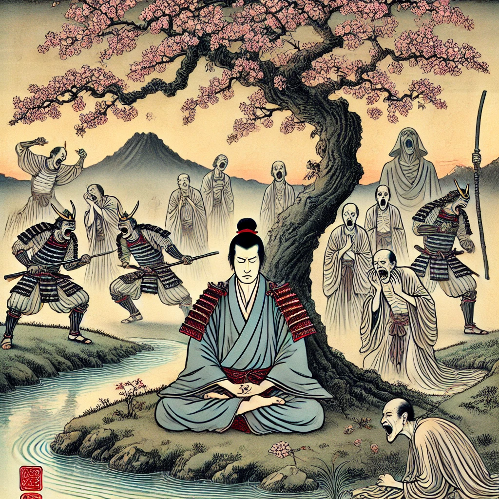

---
tags:
  - whiners 
  - habit tracker 
  - speech 
  - righteous 
  - virtues 
  - habits
---
# whiners

## related video

<iframe width="1145" height="644" src="https://www.youtube.com/embed/KFjC1yG1N5Q" title="Buddhism vs. The World" frameborder="0" allow="accelerometer; autoplay; clipboard-write; encrypted-media; gyroscope; picture-in-picture; web-share" referrerpolicy="strict-origin-when-cross-origin" allowfullscreen></iframe>

- not a stoic video but this is hitting me very hard
- because I've been struggling with this very idea and it makes my little ego a whiner LOL
- also see below the chatbots say the irish stereotypically do not whine but my grandmother did, maybe whine is not the right word lol...
- anyway I wonder sometimes if I got that habit from here and I'm trying to carry on her tradtion
- I have a feeling though that what I've learned in that video is going to turn my view in a direction that my whining habits going to end

> The darker picture is always the correct one. When you read the history of the world you are reading a saga of bloodshed and greed and folly the import of which is impossible to ignore. And yet we imagine that the future will somehow be different.
>> -- sunset limited

## other related quotes

- (learning new habits) is about becoming unfamiliar with the familiar and familiar with the unfamiliar
- zen reader: seek nothing expect nothing cling to nothing
- cormac: I don't regard my state of mind as some pessimistic view of the world I regard it as the world itself
- cormac: I don't think there's something wrong with me I just think I've finally been driven to see the truth
- heart sutra: there is no wisdom and no attainment
- heart sutra: there is no ignorance nor ending of ignorance
- heart sutra: (in emptiness) there is no feeling conception volition and consciousness
- four noble truths: suffering occurs because there is a conflict between our mind and reality

## stoic challenge

- one of the stoic challenge deck cards is: go a day without talking

## do the irish whine?

- chatgtp says: wow it mentions stoicism

The stereotype of Irish people being "whiners" is not a widely recognized or common one. In fact, Irish culture often highlights resilience, humor, and a tendency to handle difficulties with wit and stoicism. This is reflected in Ireland's history, where people faced significant hardships—such as colonialism, famine, and emigration—with remarkable strength and a sense of community.

However, like any group, individuals may express frustration or dissatisfaction in different ways, but this is not unique to Irish people. It's always important to view individuals as unique rather than relying on stereotypes, which often oversimplify and misrepresent the complexities of people and cultures.

## irish stereotypes

- chatgpt:
- damn I match some of these irish stereotypes lol

Irish people, like many other nationalities, are often subject to stereotypes, some of which are based on cultural traits, historical contexts, or media portrayals. While stereotypes can sometimes have a kernel of truth, they are often exaggerated and do not apply to all individuals. Below are some common stereotypes about Irish people:

### Positive Stereotypes

1. **Friendly and Welcoming:** Irish people are often seen as warm, hospitable, and eager to make strangers feel at home.
2. **Great Storytellers:** Ireland's rich literary and oral traditions have led to the stereotype that Irish people are natural storytellers.
3. **Musical Talent:** Irish people are often associated with a love for music, particularly traditional Irish music and dance.
4. **Humorous:** Irish people are known for their sharp wit and sense of humor.

### Negative or Overgeneralized Stereotypes

1. **Heavy Drinkers:** One of the most pervasive stereotypes is that Irish people drink a lot of alcohol, especially Guinness or whiskey.
2. **Red Hair and Fair Skin:** While red hair is more common in Ireland than in many places, not all Irish people have this trait.
3. **Love for Potatoes:** Due to historical associations, Irish people are sometimes jokingly linked to potatoes as a staple food.
4. **Fighting Spirit:** Irish people are sometimes stereotyped as being quick to anger or prone to physical fights.

### Cultural Stereotypes

1. **Religious Devotion:** Historically, Ireland's strong Catholic heritage has led to stereotypes about Irish people being very religious.
2. **Living in Rural Areas:** There’s a stereotype that Irish people predominantly live in the countryside or small villages, despite modern urbanization.

### Important Note

Stereotypes can be harmful, even when they seem positive or harmless, as they oversimplify and reduce individuals to traits that may not represent them. It's always better to appreciate people as individuals and learn about cultures through authentic experiences and conversations.
